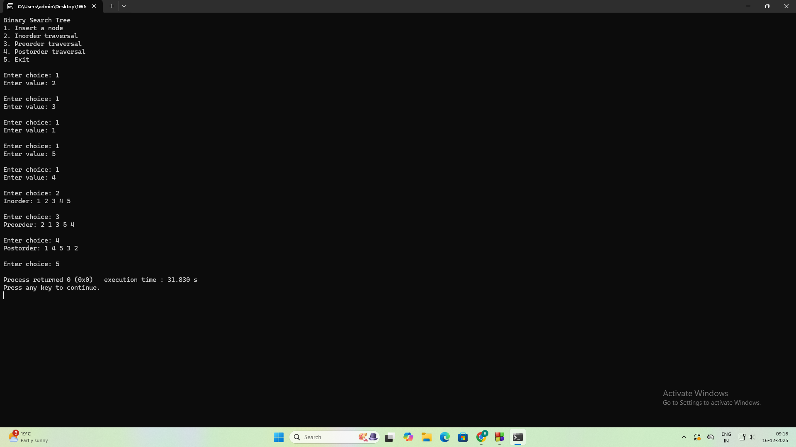
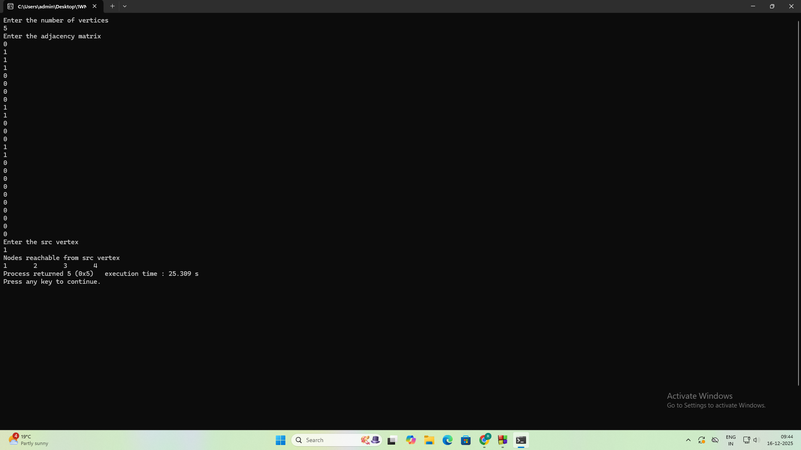

<h1>📅14/10/25</h1>
<h2>🙂Stack operations</h2>

<h2>🙂Infix to postfix expression</h2>

<h1/>📅04/11/25</h1>
<h2>🙂Linear queue</h2>

<h2>🙂Circular queue</h2>

<h1>📅11/11/25</h1>
<h2>🙂Singlly linked list</h2>

<h1>📅18/11/25</h1>
<h2>🙂Singlly linked list functions</h2>

<h1>📅25/11/25</h1>
<h2>🙂Stacks and queues using singlly linked list</h2>

<h1>📅09/12/25</h1>
<h2>🙂Doublly linked list</h2>

<h1>📅16/12/25</h1>
<h2>🙂Binary search tree</h2>

<h2>🙂Breadth first search</h2>

